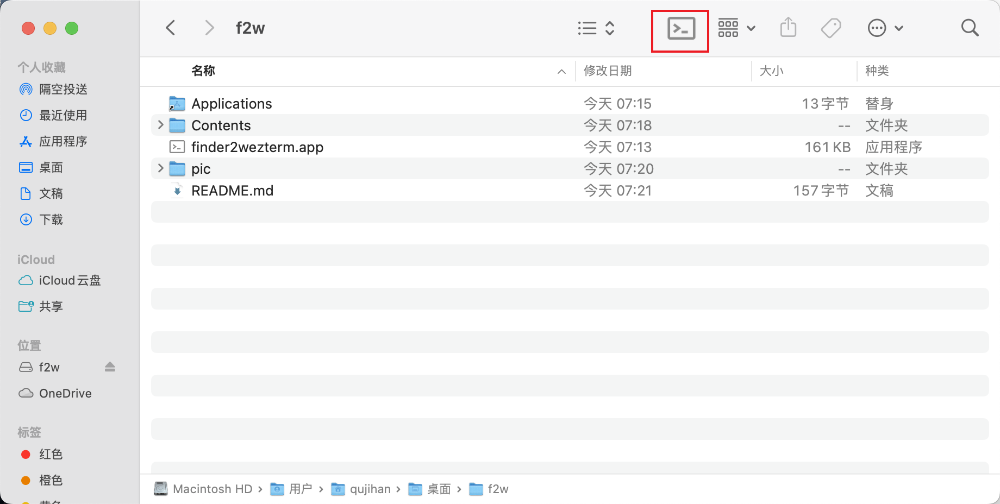
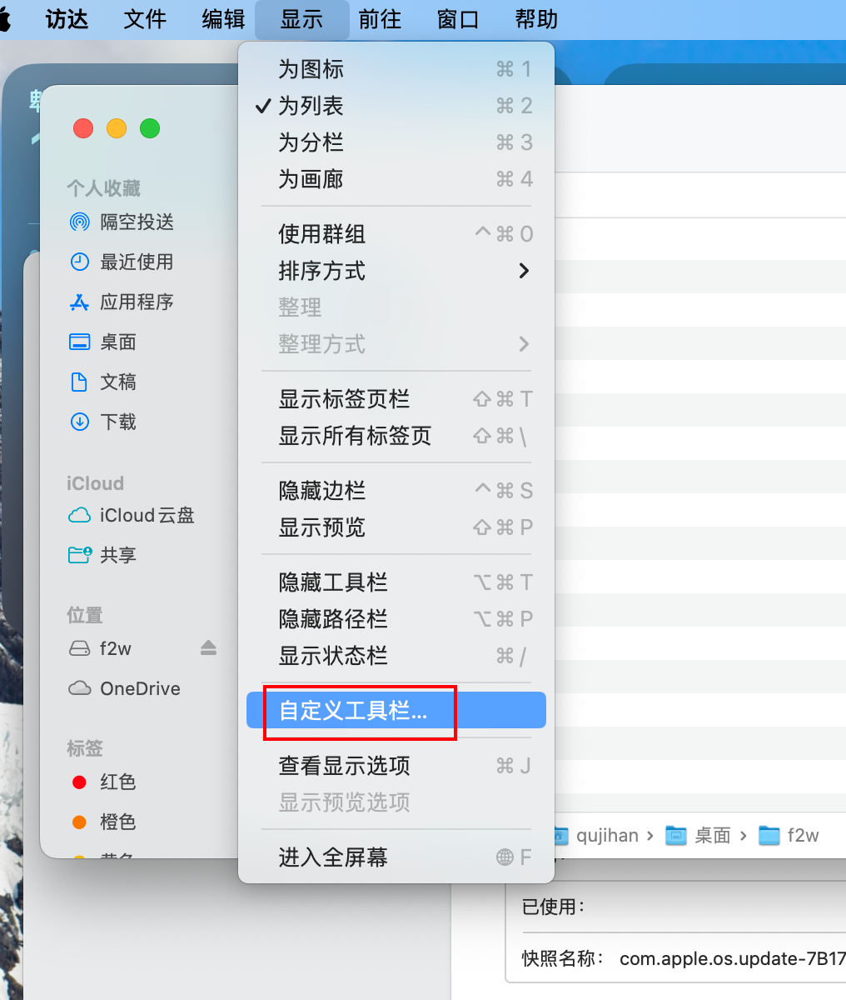

# f2w(finder2wezterm)

[中文](github.com/qujihan/f2w) | [English](https://github.com/qujihan/f2w/blob/main/README_en.md)

## 这是什么
这是在 MacOS 中的 finder 中快速打开 wezterm 这个终端的小应用

在 finder 中, 点击红色方框的按钮, 即可打开 wezterm

## 安装
下载 release 安装包以后, 将 finder2wezterm 拖拽到 Application

然后自定义工具栏里, 把 finder2wezterm 拖拽到你想放置的位置即可
